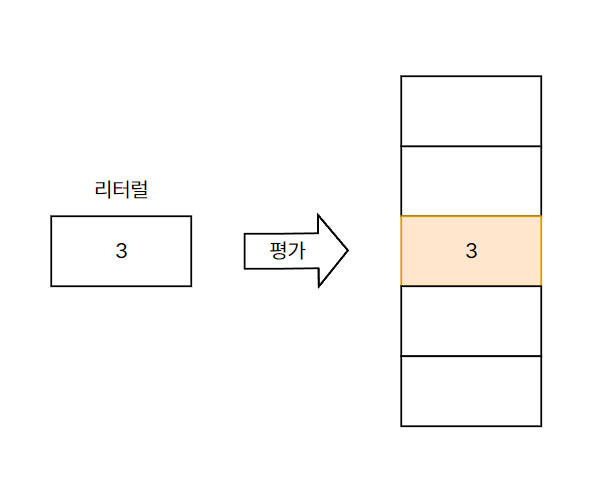

# 5. 표현식과 문

## 1. 값

표현식이 평가되어 생성된 결과  
모든 값은 데이터 타입을 가지며 메모리에 2진수로 저장된다.

```js
// 변수에는 10 + 20 이 평가되어 생성된 숫자 값이 할당 됨
var sum = 10 + 20;
```

## 2. 리터럴

사람이 이해할 수 있는 문자 또는 약속된 기호를 사용해 값을 생성하는 표기법

<figure><figcaption><p>리터럴은 평가되어 값을 생성 함</p></figcaption></figure>

자바스크립트는 코드가 실행되는 시점인 런타임에 리터럴을 평가해 값을 생성함

## 3. 표현식

값으로 평가될 수 있는 문  
즉, 표현식이 평가되면 새로운 값을 생성하거나 기존 값을 참조함.  
리터럴, 식별자(변수, 함수 등의 이름), 연산자, 함수 호출 등의 조합으로 이뤄질 수 있음

```js
// 리터럴 표현식 - 리터럴은 값으로 평가되어 리터럴도 표현식으로 볼 수 있음
10;
("Hello");

// 식별자 표현식 (선언이 이미 존재한다고 가정)
sum;
person.name;
arr[1];

// 연산자 표현식
10 + 20;
sum = 10;
sum !== 10;

// 함수/메서드 호출 표현식 (선언이 이미 존재한다고 가정)
square();
person.getName();
```

## 4. 문

프로그램을 구성하는 기본 단위이자 최소 실행 단위. 여러 토큰으로 구성됨  
선언문, 할당문, 조건문, 반복문 등으로 구분할 수 있다.

```js
// 변수 선언문
var x;

// 할당문
x = 5;

// 함수 선언문
function foo() {}

// 조건문
if (x > 1) {
  console.log(x);
}

// 반복문
for (var i = 0; i < 2; i++) {
  console.log(i);
}
```

> **토큰**  
> 문법적인 의미를 가지며, 문법적으로 더 이상 나눌 수 없는 코드의 기본 요소를 의미.  
> 컴퓨터에 내리는 **명령문**이라고도 부름

## 5. 세미콜론과 세미콜론 자동 삽입 기능

세미콜론 (`;`) : 문의 종료를 나타냄(생략가능)  
자바스크립트는 문이 종료한 위치를 파악하고 순차적으로 하나씩 문을 실행한다.

자체 종결성을 가진 if문, 반복문, 함수 등의 코드 블록 뒤에는 세미콜론을 붙이지 않음

> **생략 가능한 이유?**  
> 세미콜론 자동 삽입 기능(ASI)이 문의 끝이라고 예측되는 지점에 세미콜론을 자동으로 붙여줌

하지만 동작을 제대로 예측하지 못하는 경우가 있기에 그냥 붙이도록 하자

## 6. 표현식인 문과 표현식이 아닌 문
```js
// 값으로 평가될 수 없으므로 표현식이 아님
var x; 

// 표현식이면서 완전한 문
x = 1 + 2;
```
표현식인 문 : 값으로 평가될 수 있는 문  
평가될 수 없다면 표현식이 될 수 없다.

가장 간단하고 명료하게 구별하는 방법은 **변수에 할당해 보는 것**

```js
// 표현식이 아닌 문은 값처럼 사용할 수 없음
var foo = var x; // 사용 불가능

var x;
x = 100;

var foo = x = 100; // 사용 가능
```

### 완료 값
크롬 개발자 도구에서 표현식이 아닌 문을 실행하면 언제나 `undefined`를 출력함. 이를 **완료 값** 이라고 한다.  
완료 값은 표현식의 평가 결과가 아니기 때문에 변수에 할당할 수 없고 참조할 수 없음.
