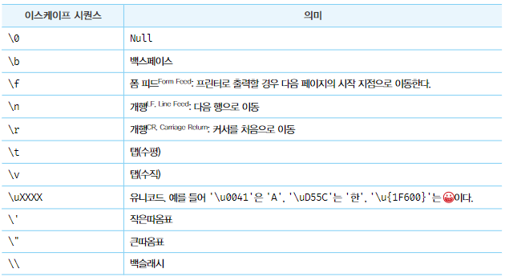

# 06. 데이터 타입

줄여서 타입이라고도 하며 값의 종류를 말함.  
자바스크립트의 모든 값은 데이터 타입을 갖는다.

<table>
  <tr>
    <th>구분</th>
    <th>데이터 타입</th>
    <th>설명</th>
  </tr>
  <tr>
    <td rowspan="6">원시타입</td>
    <td>숫자타입</td>
    <td>숫자, 정수와 실수 구분 없이 하나의 숫자 타입만 존재</td>
  </tr>
  <tr>
    <td>문자열 타입</td>
    <td>문자열</td>
  </tr>
  <tr>
    <td>불리언 타입</td>
    <td>논리적 참(true)과 거짓(false)</td>
  </tr>
  <tr>
    <td>undefined 타입</td>
    <td>var 키워드로 선언된 변수에 암묵적으로 할당되는 값</td>
  </tr>
  <tr>
    <td>null 타입</td>
    <td>값이 없다는 것을 의도적으로 명시할 때 사용하는 값</td>
  </tr>
  <tr>
    <td>심벌 타입</td>
    <td>ES6에서 추가된 7번째 타입</td>
  </tr>
  <tr>
    <td colspan="2">객체타입</td>
    <td >객체, 함수, 배열 등</td>
  </tr>
</table>

<br />

타입이 다르면 비슷해 보여도 전혀 다른 값이다.  
👉 값을 생성한 목적과 용도가 다름

## 1. 숫자 타입

C언어나 자바는 정수와 실수를 구분하여 다양한 숫자 타입(int, long, float, double 등)이 있지만

자바스크립트는 `number` 하나만 존재.  
모든 수를 실수로 처리하며 정수만 표현하기 위한 데이터 타입은 존재하지 않음

```js
console.log(1 === 1.0); // true
```

### 숫자 타입의 세가지 특별한 값

- Infinity: 양의 무한대
- -Infinity: 음의 무한대
- NaN: 산술 연산 불가(not-a-number)

```js
console.log(10 / 0); // Infinity
console.log(10 / -0); // -Infinity
console.log(1 * "String"); // NaN
```

⚠️ 자바스크립트는 대소문자를 구별하므로 `NaN` 표기시 주의 할 것

## 2. 문자열 타입

텍스트 데이터를 나타내는데 사용  
문자열은 작은따옴표(`''`), 큰따옴표(`""`) 또는 백틱(` `` `)으로 텍스트를 감싼다.

자바스크립트는 일반적으로 작은따옴표를 사용하며 따옴표로 감싸지 않으면 키워드나 식별자 같은 토큰으로 인식함

## 3. 템플릿 리터럴

멀티라인 문자열, 표현식 삽입, 태그드 템플릿 등 편리한 문자열 처리 기능을 제공

런타임에 일반 문자열로 변환되어 처리되며 백틱(` `` `)을 사용해 표현

### 3.1 멀티라인 문자열

일반 문자열 내에서는 줄바꿈이 허용되지 않음

```js
// 불가능
var str = 'Hello
world!';
```

일반 문자열 내에서 줄바꿈 등의 공백을 표현하려면 백슬래시(`\`)로 시작하는 이스케이프 시퀀스를 사용

<figure><figcaption><p>이스케이프 시퀀스</p></figcaption></figure>

템플릿 리터럴 내에서는 이스케이프 시퀀스를 사용하지 않고도 줄바꿈이 허용되며, 모든 공백도 있는 그대로 적용됨~

```js
// 이스케이프 시퀀스를 사용해 작성한 HTML 문자열
var template1 = '<ul>\n\t<li><a href="#">Home</a></li>\n</ul>';

// 템플리 리터널 내에서 작성한 HTML 문자열
var template2 = `<ul>
	<li><a href="#">Home</a></li>
</ul>`;
```

### 3.2 표현식 삽입

문자열 연산자보다 가독성 좋고 간편하게 조합 가능

```js
var cute = "귀염둥이";
var name = "하찌";
console.log("내 강아지 이름은" + name + "입니다.");

// 템플릿 리터럴
console.log(`내 강아지 이름은 ${cute} ${name} 입니다.`);
```

## 4. 불리언 타입

논리적 참(true), 거짓(false)을 나타내며 참과 거짓으로 구분되는 조건에 의해 프로그램의 흐름을 제어하는 조건문에서 자주 사용

## 5. undefined 타입

변수 선언에 의해 확보된 메모리 공간을 처음 할당이 이뤄질 때까지 자바스크립트가 초기화 시킨 값이 `undefined`

`undefined`를 개발자가 의도적으로 할당하는 것은 본래 취지와 어긋날 뿐더러 혼란을 줄 수 있으므로 권장하지 않으며 변수에 값이 없다는 것을 명시하고 싶을 땐 `null`을 할당

## 6. null 타입

프로그래밍 언어에서 `null`은 변수에 값이 없다는 것을 의도적으로 명시할 때 사용  
변수에 `null`을 할당하는 것은 변수가 이전에 참조하던 값을 더 이상 참조하지 않겠다는 뜻

⚠️ 자바스크립트는 대소문자를 구별하므로 주의

## 7. 심벌 타입

ES6에서 추가된 7번째 타입으로 변경 불가능한 원시 타입의 값  
Symbol 함수를 호출해 생성하며 생성된 심벌 값은 외부에 노출되지 않음

다른 값과 중복되지 않는 유일무이한 값이라 주로 이름이 충돌할 위험이 없는 객체의 유일한 프로퍼티 키를 만들기 위해 사용

```js
// 심벌 값 생성
var key = Symbol("key");
console.log(typeof key); // symbol

// 객체 생성
var obj = {};

// 이름이 충돌할 위험이 없는 유일무이한 값인 심벌을 프로퍼티 키로 사용
obj[key] = "value";
console.log(obj[key]); // value
```

## 8. 객체 타입

자바스크립트는 객체 기반의 언어이며 자바스크립트를 이루고 있는 거의 모든 것이 객체다.
위에 6가지 데이터 타입 이외의 값은 모두 객체 타입

자세한 내용은 나중에 ..
