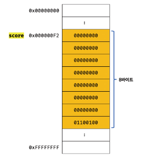

# 데이터 타입의 필요성

## 1. 데이터 타입에 의한 메모리 공간의 확보와 참조

자바스크립트는 데이터 타입(값의 종류)에 따라 정해진 크기의 메모리 공간을 확보함

```js
var score = 100;
```

리터럴 100을 숫자 타입의 값으로 해석하고 이 값을 저장하기 위해 8바이트의 메모리 공간을 확보함 그리고 100을 2진수로 저장한다.

  <figure><figcaption></figcaption></figure>

값을 참조하려면 한번에 읽어 들여야 할 메모리 셀의 개수(바이트 수)를 알아야함  
그러기 위해 자바스크립트는 score 변수의 값이 숫자 타입임을 인식하고 8바이트 단위로 메모리 공간에 저장된 값을 읽음

## 2. 데이터 타입에 의한 값의 해석

- 값을 저장할 때 확보해야 하는 **메모리 공간의 크기**를 결정하기 위해
- 값을 참조할 때 한 번에 읽어 들여야 할 **메모리 공간의 크기**를 결정하기 위해
- 메모리에서 읽어들인 **2진수를 어떻게 해석**할지 결정하기 위해
