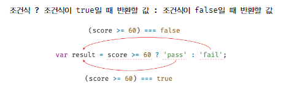

# 6. 연산자

하나 이상의 표현식을 대상으로 산술, 할당, 비교, 논리, 타입, 지수 연산등을 수행해 하나의 값을 만든다.

피연산자 : 연산의 대상 (평가될 수 있는 표현식)

```js
// 산술 연산자
5 * 4; // ➔ 20

// 문자열 연결 연산자
"My name is " + "apil"; // ➔ My name is apil

// 할당 연산자
color = "blue"; // ➔ blue

// 비교 연산자
3 > 5; // ➔ false

// 논리 연산자
true && false; // ➔ false

// 타입 연산자
typeof "Hi"; // ➔ string
```

## 1. 산술 연산자

산술 연산자(arithmetic operator)는 피연산자를 대상으로 수학적 계산을 수행해 새로운 숫자 값을 만든다.

산술 연산이 불가능 할 경우 NaN 을 반환  
피연산자의 개수에 따라 이항 산술 연산자와 단항 산술 연산자로 구분

### 1.1 이항 산술 연산자

2개의 피 연산자를 산술 연산하여 숫자 값을 만든다.  
모든 이항 연산자는 피연산자의 값을 변경하는 부수 효과가 없다.  
어떤 산술 연산을 해도 피연산자의 값이 바뀌는 경우는 없고 언제나 새로운 값을 만든다.

| 이항산술연산자 | 의미   | 부수효과 |
| -------------- | ------ | -------- |
| +              | 덧셈   | X        |
| -              | 뺄셈   | X        |
| \*             | 곱셈   | X        |
| /              | 나눗셈 | X        |
| %              | 나머지 | X        |

### 1.2 단항 산술 연산자

1개의 피연산자를 산술 연산하여 숫자 값을 만든다.

| 단항산술연산자 | 의미                                          | 부수효과 |
| -------------- | --------------------------------------------- | -------- |
| ++             | 증가                                          | O        |
| --             | 감소                                          | O        |
| +              | 어떠한 효과도 없음                            | X        |
| -              | 양수를 음수로, 음수를 양수로 반전한 값을 반환 | X        |

**1.2.1 증가/감소(`++` / `--`) 연산자**  
피연산자의 값을 변경하는 부수효과가 있음  
= 피연산자의 값을 변경하는 암묵적 할당

> **증가/감소(`++` / `--`) 연산자의 위치에 따라 다른 의미**
>
> - 피연산자 앞 : 피연산자의 값을 증가/감소 시킨 후, 다른 연산자를 수행
> - 피연산자 뒤 : 다른 연산자를 수행 후, 피연산자의 값을 증가/감소

```js
var x = 5;
var result;

// 선할당 후 증가(postfix increment oprator)
result = x++;
console.log(result, x); // 5, 6

// 선증가 후 할당(prefix increment oprator)
result = ++x;
console.log(result, x); // 7, 7

// 선할당 후 감소(postfix decrement oprator)
result = x--;
console.log(result, x); // 7, 6

// 선감소 후 할당(prefix decrement oprator)
result = --x;
console.log(result, x); // 5, 5
```

**1.2.2 `+` 단항산술연산자**  
숫자 타입이 나닌 피연산자에사용시 피연산자를 숫자타입으로 변환하여 반환  
 → 피연산자를 변경한 것이 아닌 숫자 타입으로 변환한 값을 생성해 반환하는 것이기 때문에 부수효과는 없음

**1.2.3 `-` 단항산술연산자**  
피연산자의 부호를 반전한 값을 반환
`+`와 마찬가지로 숫자 타입이 나닌 피연산자에 사용시 피연산자를 숫자타입으로 변환하여 반환

### 1.3 문자열 연결 연산자

`+` 연산자: 피연산자 중 하나 이상의 문자열인 경우 문자열 연결 연산자로 동작

```js
// 문자열 연결 연산자
"1" + 2; // '12`
1 + "2"; // '12'

// 산술 연산자
1 + 2; // 3

// true는 1로 타입 변환된다.
1 + true; // 2

// false는 0으로 타입 변환된다.
1 + false; // 1

// null는 0으로 타입 변환된다.
1 + null; // 1

// undefined는 숫자로 타입 변환되지 않는다.
+undefined; // NaN
1 + undefined; // NaN
```

위처럼 자바스크립트는 암묵적으로 타입이 자동 변환되기도 한다.  
이를 **암묵적 타입 변환** 또는 **타입 강제 변환** 이라고 함

## 2. 할당 연산자

우항에 있는 피연산자의 평가 결과를 좌항에 있는 변수에 할당  
좌항의 변수에 값을 할당하므로 변수 값이 변하는 부수효과 있음

| 할당 연산자 | 예      | 동일 표현  | 부수 효과 |
| ----------- | ------- | ---------- | --------- |
| =           | x = 5   | x = 5      | O         |
| +=          | x += 5  | x = x + 5  | O         |
| -=          | x -= 5  | x = x -5   | O         |
| \*=         | x \*= 5 | x = x \* 5 | O         |
| /=          | x /= 5  | x = x / 5  | O         |
| %=          | x %= 5  | x = x % 5  | O         |

할당문은 표현식으로 할당된 값으로 평가됨

```js
var x;
console.log((x = 10)); // 10

// 연쇄 할당
var a, b, c;
a = b = c = 0;

console.log(a, b, c); // 0 0 0
```

## 3. 비교 연산자

좌항과 우항의 피연산자를 비교한 다음 그 결과를 불리언 값으로 반환  
 if 문이나 for 문과 같은 제어문의 조건식에서 주로 사용

### 3.1 동등/일치 비교 연산자

| 비교 연산자 | 의미        | 사례    | 설명                     | 부수 효과 |
| ----------- | ----------- | ------- | ------------------------ | --------- |
| ==          | 동등 비교   | x == y  | x와 y의 값이 같음        | X         |
| ===         | 일치 비교   | x === y | x와 y의 값과 타입이 같음 | X         |
| !=          | 부동등 비교 | x != y  | x와 y의 값이 다름        | X         |
| !==         | 불일치 비교 | x !== y | x와 y의 값과 타입이 다름 | X         |

```js
// 동등 비교
5 == 5; // true

// 타입은 다르지만 암묵적 타입 변환을 통해 일치시키면 동등하다.
5 == "5"; // true
```

예측하기 어려운 결과를 만들어내기 때문에 사용하지 않는 편이 좋다

> **주의점**
>
> ```js
> // NaN 비교
> NaN === NaN;
> Number.isNaN(NaN); // true
> Number.isNaN(10); // false
> Number.isNaN(1 + undefined); // ture
>
> // 숫자 0 비교
> 0 === -0; // true
> 0 == -0; // true
> ```
>
> ⚠️ NaN은 자신과 일치하지 않는 유일한 값  
> 숫자가 NaN인지 조사하려면 빌트인함수 `Number.isNaN`을 사용
>
> 숫자 0의 경우엔 동등/일치 비교 연산자 모두 비교 결과는 true를 반환한다.

<br />

**ES6에서 도입된 `Object.is`**  
예측 가능한 정확한 비교 결과를 반환

```js
-0 === +0; // true
Object.is(-0, +0); // false

NaN === NaN; // false
Object.is(NaN, NaN); // true
```

### 3.2 대소 관계 비교 연산자

| 대소 관계 비교 연산자 | 예제   | 설명                  |
| --------------------- | ------ | --------------------- |
| >                     | x > y  | x가 y보다 크다        |
| <                     | x < y  | x가 y보다 작다        |
| >=                    | x >= y | x가 y보다 크거나 같다 |
| <=                    | x <= y | x가 y보다 작거나 같다 |

## 4. 삼항 조건 연산자

조건식의 평가 결과에 따라 반환할 값을 결정

<figure><figcaption>삼항 조건 연산자</figcaption></figure>

- 물음표 앞의 첫 번째 피연산자는 boolean 타입의 값으로 평가될 표현식(조건식)
- 만약 조건식의 평가 결과가 boolean 값이 아니면 boolean 값으로 암묵적 타입 변환 된다.
- 삼항 조건 연산자는 값으로 평가될 수 있는 표현식인 문으로 값처럼 다른 표현식의 일부가 될 수 있어 매우 유용함

> **if...else문과 차이점**
>
> - 삼항 조건 연산자 표현식은 값처럼 사용할 수 있지만 if...else문은 값처럼 사용할 수 없음
> - 조건에 따라 수행해야 할 문이 하나가 아니라 여러 개라면 if...else문의 가독성이 더 좋음

## 5. 논리 연산자

우항과 좌항의 피연산자를 논리 연산

| 논리 연산자 | 의미        | 부수 효과 |
| ----------- | ----------- | --------- |
| II          | 논리합(OR)  | X         |
| &&          | 논리곱(AND) | X         |
| !           | 부정(NOT)   | X         |

```js
// 논리합(||) 연산자
true || true; // true
true || false; // true
false || true; // true
false || false; // false

// 논리곱(&&) 연산자
true && true; // true
true && false; // false
false && true; // false
false && false; // false

// 논리 부정(!) 연산자는 언제나 boolean 값을 반환 ➔ 암묵적 타입 변환
!0; // true
!"Hello"; // false
```

> **[💡참고] if 구문에서 비교 연산을 동시에 할 경우**  
> 앞의 것부터 뒤의 것을 순차적으로 연산하고  
> `||` 연산의 경우 앞의 것이 1개라도 참이라면 더 이상 연산을 하지 않고  
> `&&` 연산의 경우 앞의 것이 1개라도 거짓이라면 더 이상 연산을 하지 않음

> **드 모르간의 법칙**  
> 논리곱(합)의 부정은 각각 부정의 논리합(곱)과 같다는 법칙  
> 논리 연산자로 구성된 복잡한 표현식은 가독성이 좋지 않아 한눈에 이해하기 어려울때가 있는데 드 모르간의 법칙을 활용하면 좀 더 가독성 좋은 표현식으로 변환할 수 있다.
>
> ```js
> !(x || y) === (!x && !y);
> !(x && y) === (!x || !y);
> ```

## 6. 쉼표 연산자

왼쪽 피연산자부터 차례대로 피연산자를 평가하고  
마지막 피연산자의 평가가 끝나면 마지막 피연산자의 평가 결과를 반환

```js
var x, y, z;
x = 1, y = 2, z = 3; // 3
```

## 7. 그룹 연산자

소괄호(`()`)로 피연산자를 감싸는 그룹 연산자는 자신의 피연산자인 표현식을 가장 먼저 평가

- 연산자의 우선순위를 조절 할 수 있음
- 연산자 우선순위가 가장 높음

```js
10 * 2 + 3; // 23
10 * (2 + 3); // 50
```

## 8. typeof 연산자

피연산자의 데이터 타입을 문자열로 반환

- null 을 반환하는 경우는 없음
- 함수의 경우 function 을 반환
- typeof 연산자로 null 값을 연산해 보면 object 를 반환 (자바스크립트 버그)  
   null 타입인지 확인 할 때는 일치 연산자(`===`) 사용 권장

  ```js
  typeof "";              // string
  typeof 1;               // number
  typeof NaN;             // number
  typeof true;            // boolean
  typeof undefined;       // undefined
  typeof Symbol();        // symbol
  typeof null;            // object
  typeof [];              // object
  typeof {};              // object
  typeof new Date();      // object
  typeof /test/gi;        // object
  typeof function () {};  // function

  // null 타입 확인은 typeof 사용 X
  var foo = null;

  typeof foo === null; // false
  foo === null; // true

  // 선언하지 않은 식별자는 undefined를 반환
  var hello;

  typeof hello  //undefined
  ```
## 9. 지수 연산자
ES7 에서 도입  
좌항의 피연산자를 밑으로 우항의 피연산자를 지수로 거듭 제곱하여 숫자 값을 반환

```js
2 ** 2;         // 4
Math.pow(2, 2); // 4 (지수 연산자가 도입되기 이전엔 Math.pow 메서드 사용)

// 음수를 밑으로 사용하려면 괄호로 묶어야 함
(-5) ** 2;    // 25

// 할당연산자와 함께 사용 가능
var num = 5;
num **= 2     // 25

// 지수 연산자는 이항 연산자 중에서 우선순위가 가장 높음
2 * 5 ** 2;   // 50
```

## 10. 그 외의 연산자

| 연산자     | 개요                                                        |
| ---------- | ----------------------------------------------------------- |
| ?.         | 옵셔널 체이닝 연산자                                        |
| ??         | null 병합 연산자                                            |
| delete     | 프로퍼티 삭제                                               |
| new        | 생성자 함수를 호출할 때 사용하여 인스턴스를 생성            |
| instanceof | 좌변의 객체가 우변의 생성자 함수와 연결된 인스턴스인지 판별 |
| in         | 프로퍼티 존재 확인                                          |

나중에 하나씩 다룰 예정


[연산자의부수효과.md](연산자의부수효과.md)



[연산자의우선순위와결합순위.md](연산자의우선순위와결합순위.md)
