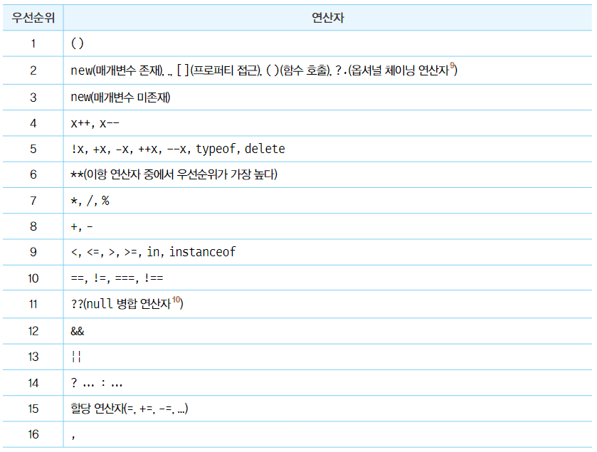
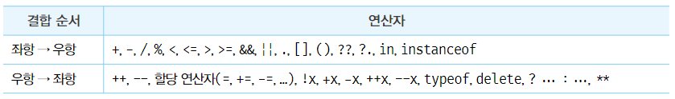

# 1. 연산자 우선순위
여러개의 연산자로 이루어진 문이 실행될 때 **연산자가 실행되는 순서**

<figure><figcaption></figcaption></figure>

우선순위를 모두 기억하기 어려우므로 그룹연산자를 사용하는 것을 권장

# 2. 연산자 결합순서

연산자의 어느 쪽(좌항 또는 우항)부터 평가를 수행할 것인지를 나타내는 순서

<figure><figcaption></figcaption></figure>
